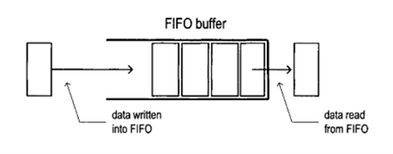
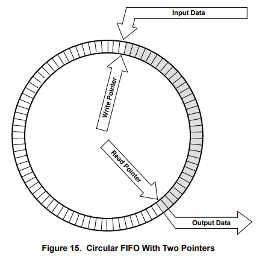
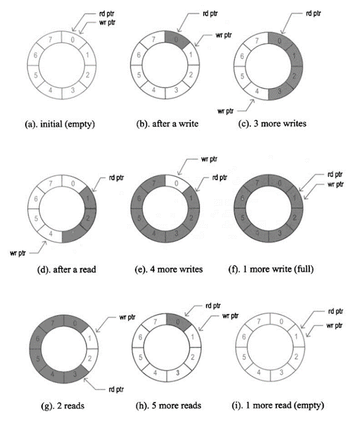

# FIFO_using_ArtyZ7

## Table of Contents:
### 0. List of members implementing the project (Danh sách thành viên):

|STT|MSSV|Họ và tên|
|:---:|----|:---------:|
|1|2112173|Phạm Hồng My Sa|
|2|2213857|Võ Ngọc Tú|
|3|2211186|Lê Đăng Huy|
|4|2213561|Trịnh Thu Trang|

### 1. Introduction: Theory and Applications of First In First Out (FIFO) 
  - **Theory (Khái niệm):** FIFO là một bộ đệm đặc biệt, FIFO viết tắt cho First In First Out, nghĩa là dữ liệu nào được ghi vào bộ đệm trước sẽ ra khỏi bộ đệm trước. Có 3 loại FIFO: *Shift register – FIFO*, *Exclusive read/write FIFO* và *Concurrent read/write FIFO*.

  - **Implement (Hiện thực):** FIFO có thể hiện thực bằng thanh ghi dịch – phần cứng (hardware shift register) hoặc dùng các cấu trúc bộ nhớ khác, điển hình là FIFO vòng (circular buffer, ring buffer, array-base bufer), hoặc danh sách (list). Ở đây chúng ta sẽ nghiên cứu về mô hình FIFO được hiện thực thông qua cấu trúc Ring buffer.
    - ***Ring Buffer (Circular Buffer):*** Buffer vòng không có điểm cuối thực tế và nó sẽ lặp lại (loop) vòng quanh trong buffer.
 
    - ***Hiện thực FIFO bằng buffer vòng:*** Bộ đệm này được thực hiện dựa trên một mảng. Kèm theo đó là 2 con trỏ Write và Read.
      - Khi bắt đầu, con trỏ pWrite và pEnd đều cùng trỏ vào vị trí đầu tiên (index 0).
      - Mỗi khi nhận lệnh ghi, con trỏ pWrite sẽ ghi data vào bộ đệm, sau đó sẽ tăng lên 1 đơn vị (pWrite++). Mỗi khi nhận lệnh đọc, dữ liệu được con trỏ pRead trỏ vào sẽ được đọc ra và con trỏ pRead sẽ tăng lên một (pRead++).
      - Khi 1 con trỏ tới được cuối mảng, nó sẽ cuộn lại vị trí đầu tiên.
      - Nếu (pRead == pWrite), chứng tỏ bộ đệm đang trống (empty), không có gì để đọc.
      - Nếu (pWrite + 1 == pRead), chứng tỏ bộ đệm đang đầy (full), không thể ghi thêm.

  - **Applications (Ứng dụng):** FIFO thường được sử dụng trong các mạch điện tử để đệm (buffering) và điều khiển luồng (flow) giữa phần cứng và phần mềm; cũng thường được ứng dụng trong lĩnh vực quản lý hàng hóa;...

### 2.	Design and implement a FIFO circuit using Verilog HDL
***Source code:*** BTL.v

Dựa trên ý tưởng đã trình bày ở trên, nhóm đã từ đó nghiên cứu và đưa ra đoạn code hoàn chỉnh cho một FIFO cơ bản được hiện thực bằng cấu trúc ring buffer. Bài làm được hiện thực trên phần mềm Vivado và Arty-Z7 FPGA circuit.

### 3.	Testbench
***Source code:*** BTL_tb.v

### 4.	Demo on board
***Source code:*** BTL_board.v, longer_clk.v

Code BTL_board.v dùng để hiện thực trên board thay đổi so với code BTL.v:
  - Thay đổi kích thước dữ liệu data_in vào FIFO từ 8 bit thành 1 bit để hiện thực trên board dễ quan sát data_out (1 bit: bit 0 – đèn tắt, bit 1 – đèn sáng).
  - clk được scale lại (thông qua temp_clk với chu kì dài hơn) để có thể dễ dàng quan sát output.
